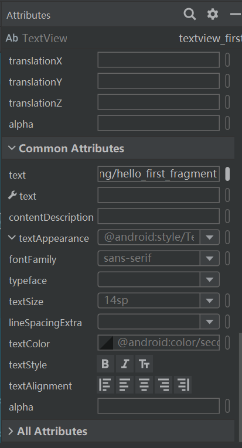
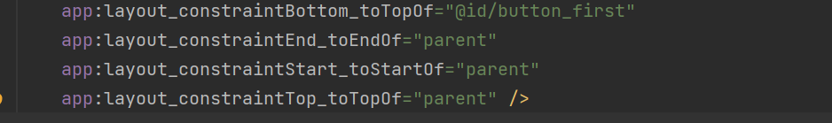
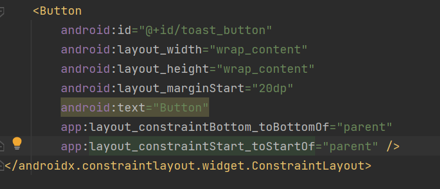
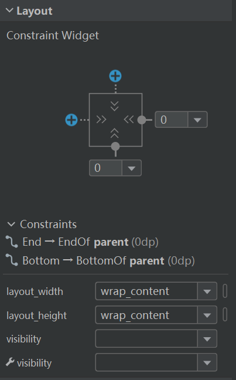
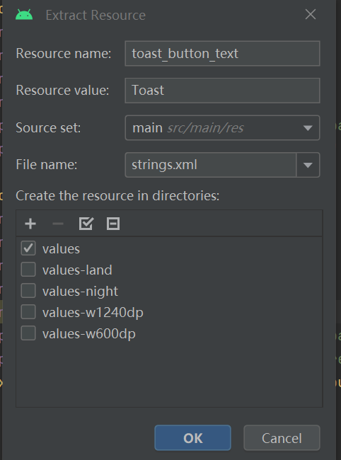
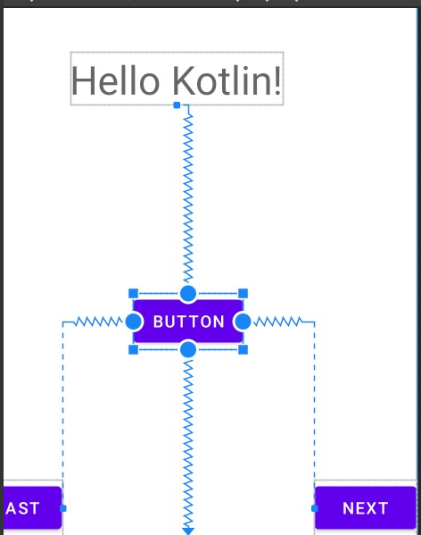
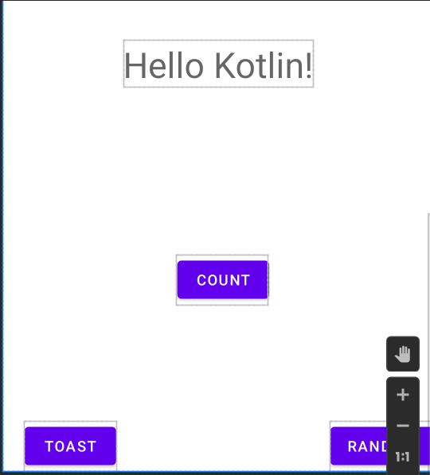
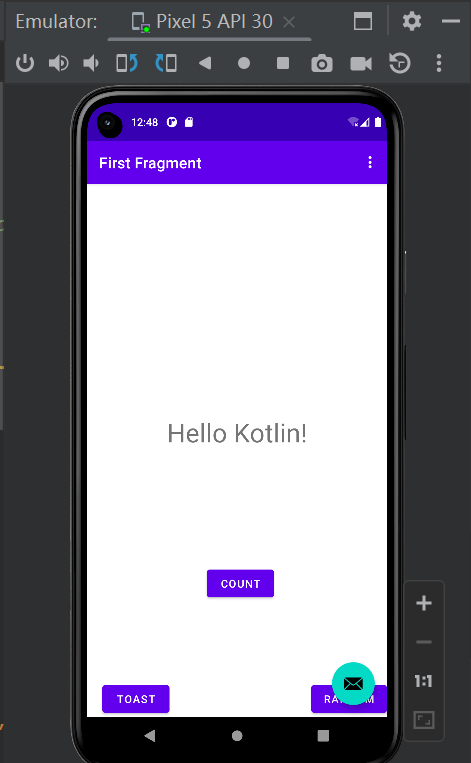

## 创建第一个Kotlin应用

### 1.创建Kotlin应用

选择创建一个Basic Activity，选择Kotlin语言，并命名应用程序

File -> new -> new project

选择 Basic Activity

选择kotlin后finish ，需要一段时间加载gradle

### 2. 编译生成应用并创建虚拟设备

Android Studio支持虚拟设备（模拟器）的创建，以运行应用程序

模拟器:

### 3. 查看布局编辑器

布局文件：res>layout>fragment_first.xml

右侧Code Split Design 

### 4.向页面添加更多的布局

查看布局的代码（Code），修改Textview的**Text**属性，

找到目标代码，右键该代码，选择**Go To > Declaration or Usages**

跳转到values/strings.xml

修改字符串属性值为“Hello Kotlin!”。更进一步，修改字体显示属性，

在Design视图中选择textview_first文本组件，在Common 

Attributes属性下的textAppearance域，设置相关的文字显示属性

选择display1 ，后在代码中有所体现。

(fragment_first.xml)

关于testview组件的约束

从Palette中拖动button

调整Button的约束:

调整next 按钮：

在属性面板的Constraint Widget中移动光标到相应约束点击删除。

删除左侧或上测的约束

弹出对话框，令资源名为toast_button_text，资源值为Toast，并点击OK。

添加新的button

添加完按钮并且重命名之后的页面：

先试运行后的结果：

### 5.添加代码完成应用程序交互

* 设置代码自动补全

  File>New Projects Settings>Settings for New Projects…（直接setting就是），查找Auto Import选项，在Java和Kotlin部分，勾选Add Unambiguous Imports on the fly。