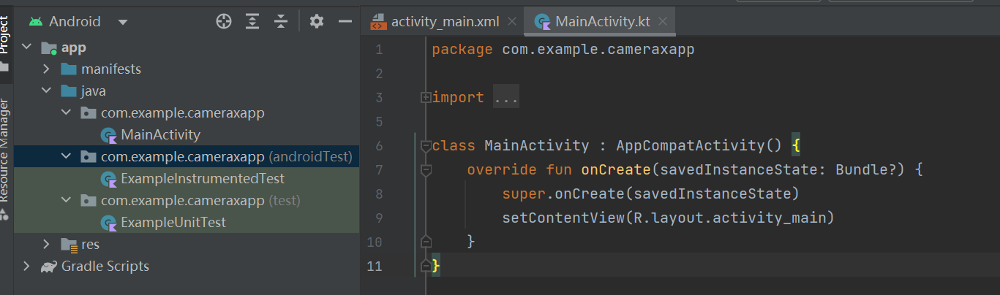
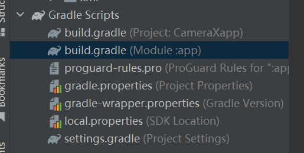
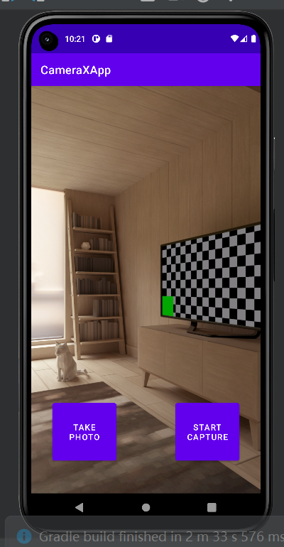
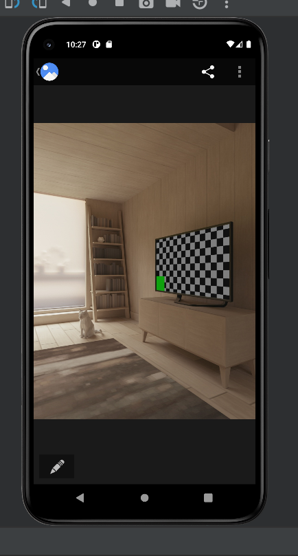
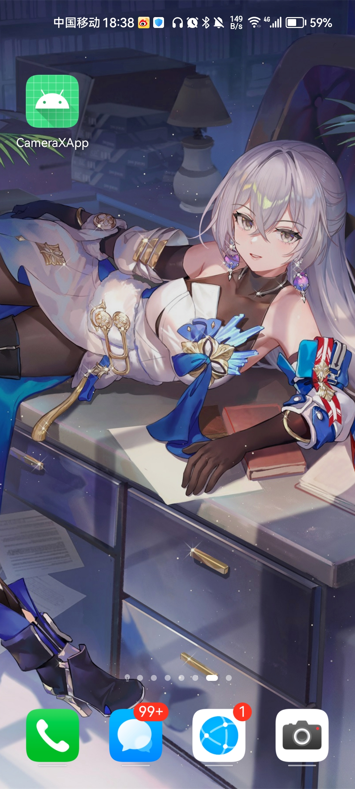

## 构建CameraX应用

### 创建项目

创建一个新项目，选择“Empty Activity"

初始化界面



#### 添加依赖



在module的build.grade文件，并且添加依赖项

```kotlin
dependencies {
  def camerax_version = "1.1.0-beta01"
  implementation "androidx.camera:camera-core:${camerax_version}"
  implementation "androidx.camera:camera-camera2:${camerax_version}"
  implementation "androidx.camera:camera-lifecycle:${camerax_version}"
  implementation "androidx.camera:camera-video:${camerax_version}"

  implementation "androidx.camera:camera-view:${camerax_version}"
  implementation "androidx.camera:camera-extensions:${camerax_version}"
}
```

CameraX 需要一些属于 Java 8 的方法，因此需要相应地设置编译选项（实际上比较新的Android Studio版本会默认设置）。在 android 代码块的末尾，紧跟在 buildTypes 之后，添加以下代码：

```kotlin
compileOptions {
    sourceCompatibility JavaVersion.VERSION_1_8
    targetCompatibility JavaVersion.VERSION_1_8
}
```

发现本应添加如上代码，但在本版本中已经自动生成。

因为在项目中使用了viewbinding，在 android{} 代码块末尾添加如下代码：

````kotlin
buildFeatures {
   viewBinding true
}
````

点击灯泡处 Sync now 

#### 创建项目布局

打开res/layout/activity_main.xml 的 activity_main 布局文件，进行代码替换

接下来，更新res/values/strings.xml 文件

#### 编写 MainActivity.kt

将 MainActivity.kt 中的代码替换为以下代码，但保留软件包名称不变。它包含 import 语句、将要实例化的变量、要实现的函数以及常量。

系统已实现 onCreate()，供我们检查相机权限、启动相机、为照片和拍摄按钮设置 onClickListener()，以及实现 cameraExecutor。虽然系统已经实现 onCreate()，但在实现文件中的方法之前，相机将无法正常工作。


### 请求必要的权限

应用需要获得用户授权才能打开相机；录制音频也需要麦克风权限；在 Android 9 § 及更低版本上，MediaStore 需要外部存储空间写入权限。在此步骤中，我们将实现这些必要的权限。

打开 AndroidManifest.xml，然后将以下代码行添加到 application 标记之前。

```kotlin
<uses-feature android:name="android.hardware.camera.any" />
<uses-permission android:name="android.permission.CAMERA" />
<uses-permission android:name="android.permission.RECORD_AUDIO" />
<uses-permission android:name="android.permission.WRITE_EXTERNAL_STORAGE"
   android:maxSdkVersion="28" />

```

运行应用，可发现应用程序请求使用摄像头和麦克风

### 实现 Preview 用例

在相机应用中，取景器用于让用户预览他们拍摄的照片。我们将使用 CameraX Preview 类实现取景器。

如需使用 Preview，首先需要定义一个配置，然后系统会使用该配置创建用例的实例。生成的实例就是绑定到 CameraX 生命周期的内容。填充之前的startCamera() 函数
最后，运行应用，可以看到相机预览



### 实现ImageCapture 用例 （拍照功能）

其他用例与 Preview 非常相似。首先，定义一个配置对象，该对象用于实例化实际用例对象。若要拍摄照片，需要实现 takePhoto() 方法，该方法会在用户按下 photo 按钮时调用。填充takePhoto() 方法的代码：

（填充fun takePhoto）

接下来修改startCamera 方法

重新运行应用，然后按 Take Photo。屏幕上应该会显示一个消息框，会在日志中看到一条消息。重新运行应用，然后按 Take Photo。屏幕上应该会显示一个消息框，会在日志中看到一条消息。

这时可以查看本地的图片库，查看刚刚拍摄的图片。

在Gallery中：



### 实现 ImageAnalysis 用例

使用 ImageAnalysis 功能可让相机应用变得更加有趣。它允许定义实现 ImageAnalysis.Analyzer 接口的自定义类，并使用传入的相机帧调用该类。无需管理相机会话状态，甚至无需处理图像；与其他生命周期感知型组件一样，仅绑定到应用所需的生命周期就足够了。

将此分析器添加为 MainActivity.kt 中的内部类。分析器会记录图像的平均亮度。如需创建分析器，我们会替换实现 ImageAnalysis.Analyzer 接口的类中的 analyze 函数。


立即运行应用！它会大约每秒在 logcat 中生成一个类似于下面的消息。

```kotlin
D/CameraXApp: Average luminosity: ...
```

### 实现 VideoCapture 用例（拍摄视频）

1. 将以下代码复制到captureVideo() 方法：该方法可以控制 VideoCapture 用例的启动和停止。

   ````kotlin
   // Implements VideoCapture use case, including start and stop capturing.
   private fun captureVideo() {
      val videoCapture = this.videoCapture ?: return
   
      viewBinding.videoCaptureButton.isEnabled = false
   
      val curRecording = recording
      if (curRecording != null) {
          // Stop the current recording session.
          curRecording.stop()
          recording = null
          return
      }
   
      // create and start a new recording session
      val name = SimpleDateFormat(FILENAME_FORMAT, Locale.US)
                 .format(System.currentTimeMillis())
      val contentValues = ContentValues().apply {
          put(MediaStore.MediaColumns.DISPLAY_NAME, name)
          put(MediaStore.MediaColumns.MIME_TYPE, "video/mp4")
          if (Build.VERSION.SDK_INT > Build.VERSION_CODES.P) {
              put(MediaStore.Video.Media.RELATIVE_PATH, "Movies/CameraX-Video")
          }
      }
   
      val mediaStoreOutputOptions = MediaStoreOutputOptions
          .Builder(contentResolver, MediaStore.Video.Media.EXTERNAL_CONTENT_URI)
          .setContentValues(contentValues)
          .build()
      recording = videoCapture.output
          .prepareRecording(this, mediaStoreOutputOptions)
          .apply {
              if (PermissionChecker.checkSelfPermission(this@MainActivity,
                      Manifest.permission.RECORD_AUDIO) ==
                  PermissionChecker.PERMISSION_GRANTED)
              {
                  withAudioEnabled()
              }
          }
          .start(ContextCompat.getMainExecutor(this)) { recordEvent ->
              when(recordEvent) {
                  is VideoRecordEvent.Start -> {
                      viewBinding.videoCaptureButton.apply {
                          text = getString(R.string.stop_capture)
                          isEnabled = true
                      }
                  }
                  is VideoRecordEvent.Finalize -> {
                      if (!recordEvent.hasError()) {
                          val msg = "Video capture succeeded: " +
                              "${recordEvent.outputResults.outputUri}"
                          Toast.makeText(baseContext, msg, Toast.LENGTH_SHORT)
                               .show()
                          Log.d(TAG, msg)
                      } else {
                          recording?.close()
                          recording = null
                          Log.e(TAG, "Video capture ends with error: " +
                              "${recordEvent.error}")
                      }
                      viewBinding.videoCaptureButton.apply {
                          text = getString(R.string.start_capture)
                          isEnabled = true
                      }
                  }
              }
          }
   }
   ````

   

2.在 startCamera() 中，将以下代码放置在 preview 创建行之后。这将创建 VideoCapture 用例。

```kotlin
val recorder = Recorder.Builder()
   .setQualitySelector(QualitySelector.from(Quality.HIGHEST))
   .build()
videoCapture = VideoCapture.withOutput(recorder)
```

3.将 Preview + VideoCapture 用例绑定到生命周期相机。仍在 startCamera() 内，将 cameraProvider.bindToLifecycle() 调用替换为以下代码

```kotlin
// Bind use cases to camera
cameraProvider.bindToLifecycle(this, cameraSelector, preview, videoCapture)

```

4.构建并运行项目

最后在手机端设置选取开发者模式，然后在电脑端运行该应用，可以得到自动下载一个APP   -  CameraXApp。

该APP可以使用上述所展示的功能，并且通过他进行拍照。

