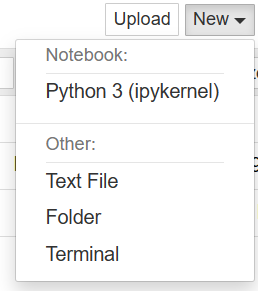
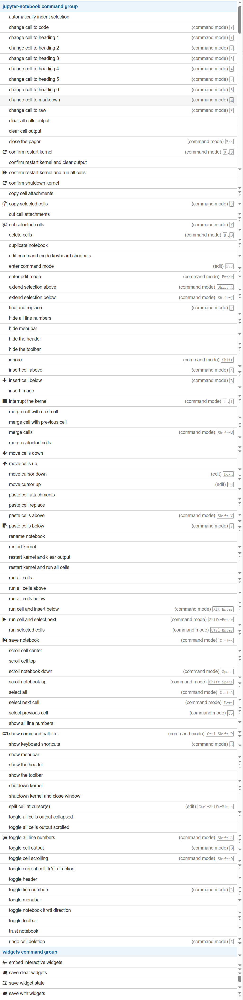
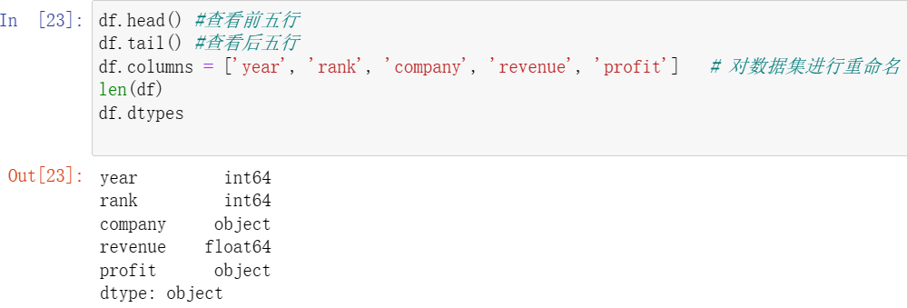
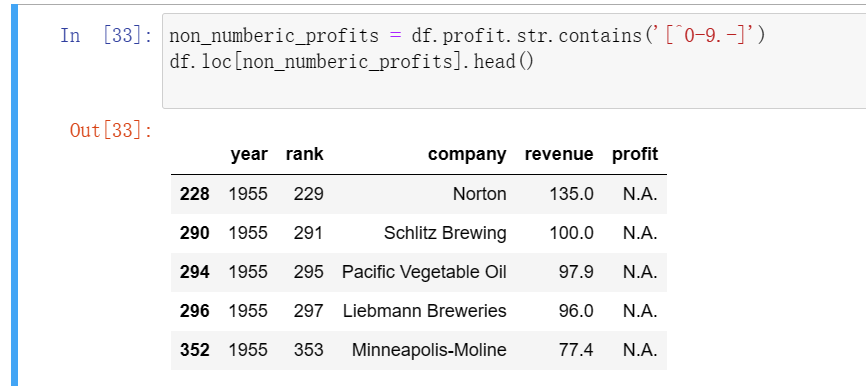
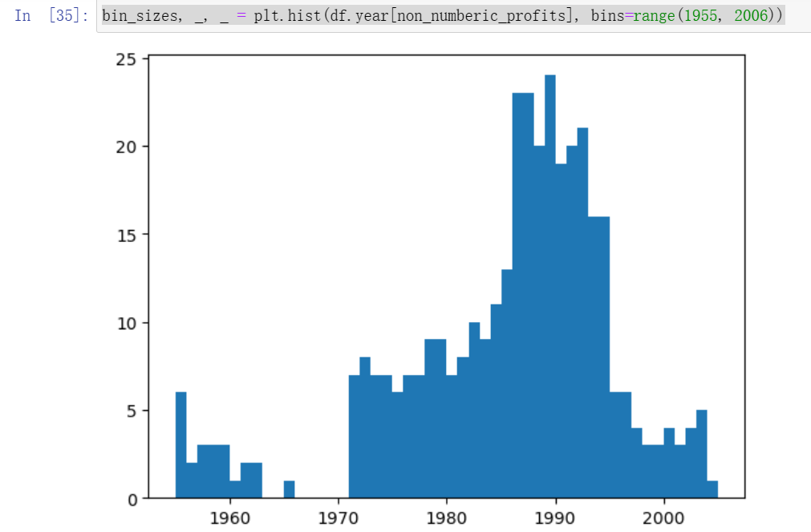
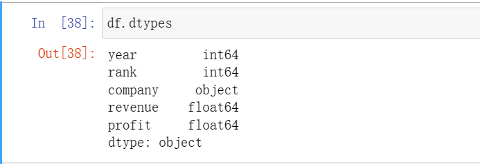
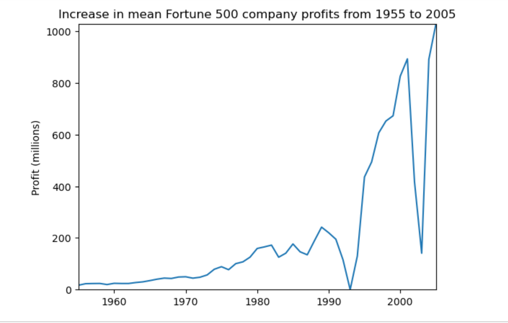
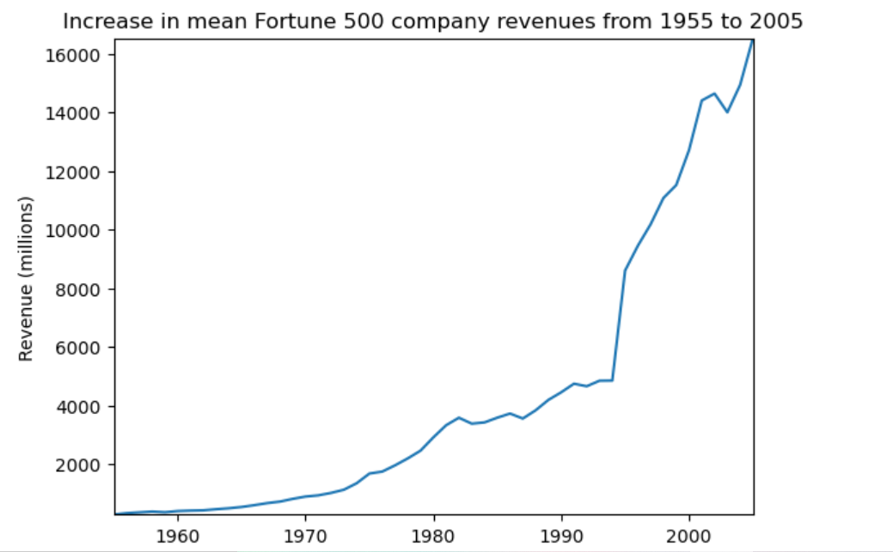
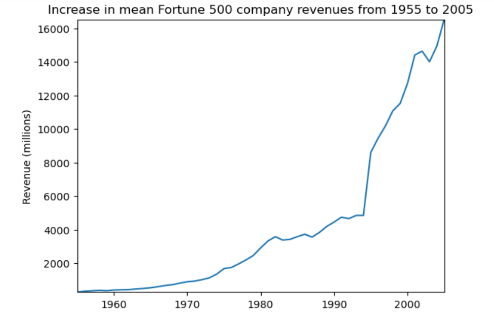
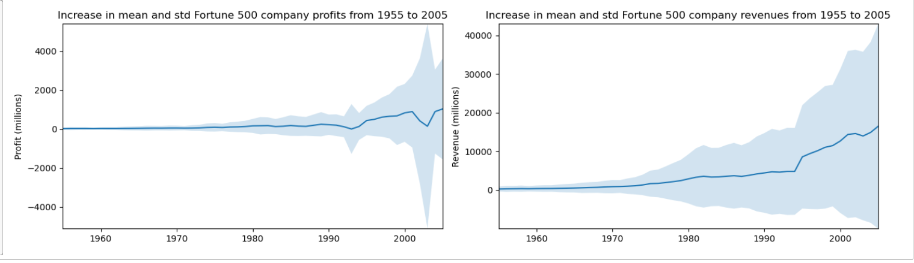

## Jupyter Notebook 实践

### Jupyter notebook简介

#### 创建一个新的Jupyter Notebook

Anaconcda3(64-bit)>>Jupyter Notebook



新建的界面如下：


#### cell

```python
import time
time.sleep(3)
```


In [*] 会持续三秒钟，之后变成In [1]

#### 快捷键

 Ctrl + Shift + P



#### Kernal

​		每个notebook都基于一个内核运行，当执行cell代码时，代码将在内核当中运行，运行的结果会显示在页面上。Kernel中运行的状态在整个文档中是延续的，可以跨越所有的cell。这意思着在一个Notebook某个cell定义的函数或者变量等，在其他cell也可以使用。

### 简单的python程序的例子

完成基于python的选择排序算法：

1. 定义selection_sort函数执行选择排序功能。

2. 定义test函数进行测试，执行数据输入，并调用selection_sort函数进行排序，最后输出结果。

   ```python
   #找最小值索引
   def getmin(arr):
       min = arr[0]
       min_index = 0
       for i in range(0,len(arr)):
           if arr[i] < min:
               min = arr[i]
               min_index = i 
       return min_index
   def selection_sort(arr):
       newarr = []
       for i in range(0,len(arr)):
           min_index = getmin(arr)
           newarr.append(arr.pop(min_index))
       return newarr
   
   def text(arr):
       print(selection_sort(arr))
       
   arr = [3,2,5,4,1,7,6,9,8]
   text(arr)
   ```

   

### 数据分析的例子

导入工具库 

```python
%matplotlib inline
import pandas as pd
import matplotlib.pyplot as plt
import seaborn as sns
```

加载数据集

```python
df = pd.read_csv(r'E:\newdata\fortune500.csv')
# 注意加上转义字符r
```

```python
df.head() #查看前五行
df.tail() #查看后五行
df.columns = ['year', 'rank', 'company', 'revenue', 'profit']   # 对数据集进行重命名
len(df)
df.dtypes
```



因为profit属性，我们所期待的是float属性，但实际显示为object属性，因此它可能包含一些非数字类型的值，接下来通过正则表达式进行检查。

```python
non_numberic_profits = df.profit.str.contains('[^0-9.-]')
df.loc[non_numberic_profits].head()
```




 contains方法（在operator模块）： 判断子串是否在原字符串中。

查看profit为字符串的条数的记录

```python
len(df.profit[non_numberic_profits])
```

结果为369

```python
bin_sizes, _, _ plt.hist(df.year[non_numberic_profits], bins=range(1955, 2006))
```



此为利润按照年份的分布情况

```python
# 删除profits非数字型数据
df = df.loc[~non_numberic_profits]
df.profit = df.profit.apply(pd.to_numeric)
len(df)
```

结果显示为25131条数据，再次查看df.dtypes



```python
# 以年分组绘制平均利润和收入  
group_by_year = df.loc[:, ['year', 'revenue', 'profit']].groupby('year')
avgs = group_by_year.mean()
x = avgs.index
y1 = avgs.profit
def plot(x, y, ax, title, y_label):
    ax.set_title(title)
    ax.set_ylabel(y_label)
    ax.plot(x, y)
    ax.margins(x=0, y=0)
fig, ax = plt.subplots()
plot(x, y1, ax, 'Increase in mean Fortune 500 company profits from 1955 to 2005', 'Profit (millions)')
```



```python
y2 = avgs.revenue
fig, ax = plt.subplots()
plot(x, y2, ax, 'Increase in mean Fortune 500 company revenues from 1955 to 2005', 'Revenue (millions)')
```



```python
y2 = avgs.revenue
fig, ax = plt.subplots()
plot(x, y2, ax, 'Increase in mean Fortune 500 company revenues from 1955 to 2005', 'Revenue (millions)')
```



```python
def plot_with_std(x, y, stds, ax, title, y_label):
    ax.fill_between(x, y - stds, y + stds, alpha=0.2)
    plot(x, y, ax, title, y_label)
fig, (ax1, ax2) = plt.subplots(ncols=2)
title = 'Increase in mean and std Fortune 500 company %s from 1955 to 2005'
stds1 = group_by_year.std().profit.values
stds2 = group_by_year.std().revenue.values
plot_with_std(x, y1.values, stds1, ax1, title % 'profits', 'Profit (millions)')
plot_with_std(x, y2.values, stds2, ax2, title % 'revenues', 'Revenue (millions)')
fig.set_size_inches(14, 4)
fig.tight_layout()
```


