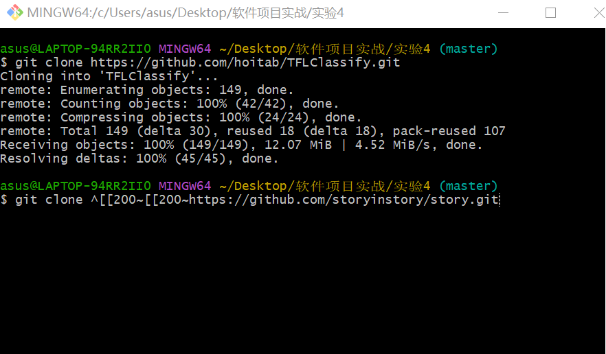
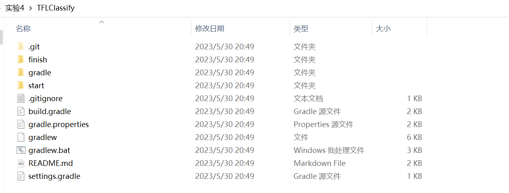
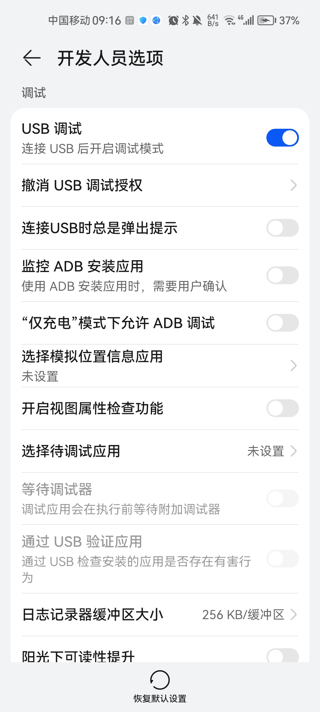
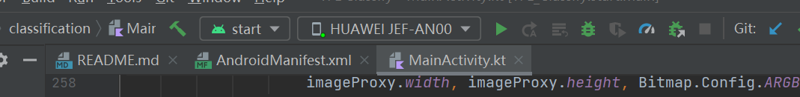
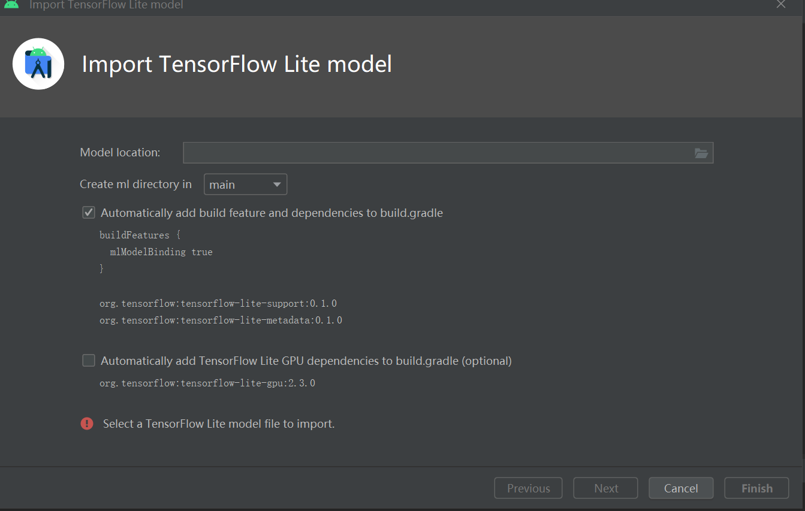
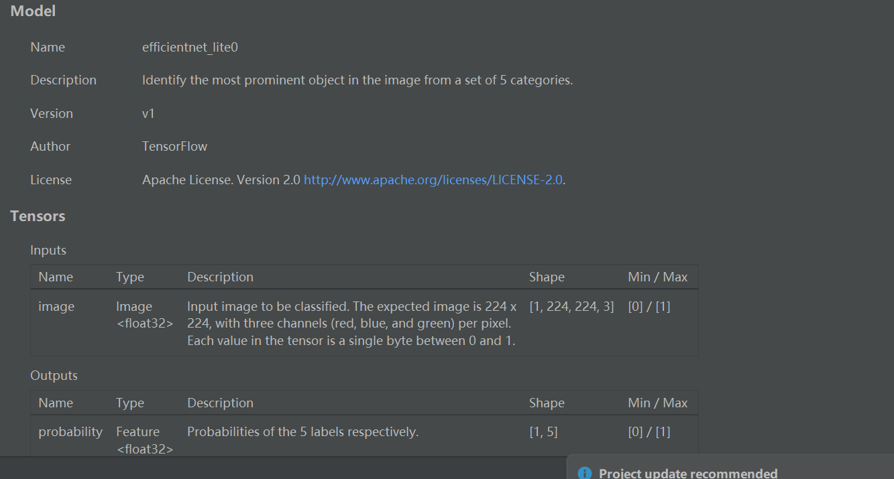
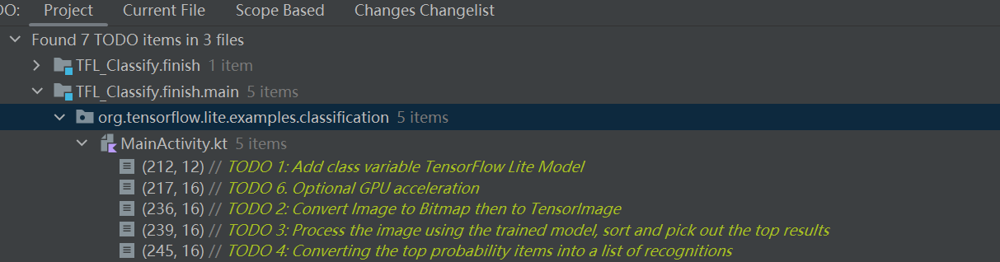

## 实验四 基于TensorFlow Lite实现的Android花卉识别应用

### 1. 预备工作

安装Android Studio 4.1以上版本  -- 在之前实验中已完成

### 2. 下载初始代码

创建工作目录，使用

```cmd
git clone https://github.com/hoitab/TFLClassify.git
```

拷贝代码

git bash 界面 



导入后的新文件夹



### 3. 运行初始代码

1. 打开Android Studio，选择“Open an Existing Project”
2. 选择TFLClassify/build.gradle生成整个项目。项目包含两个module：finish 和 start，finish模块是已经完成的项目，start则是本项目实践的模块。
3. 第一次编译项目时，弹出“Gradle Sync”，将下载相应的gradle wrapper 。

（本步骤没有遇到过）

报错 ： 第一次进入项目时，start模块报错，经检查原因是SDK出错，重新下载SDK

（File -Setting - SystemSetting- Android SDK - Edit）

修改完成之后自动 Gradle project sync in progress

 4. 手机通过USB接口连接开发平台，并设置手机开发者选项允许调试。

    华为机型开发着模式开启:

    设置-关于手机-版本号点击七次-回到系统与更新-开发人员选项

    移动端打开USB调试

    

    

	4. 选择真实物理机（而不是模拟器）运行start模块


### 4. 向应用中添加 TensorFlow Lite

1. 选择"start"模块

2. 右键“start”模块，或者选择File，然后New>Other>TensorFlow Lite Model

3. 选择已经下载的自定义的训练模型。本教程模型训练任务以后完成，这里选择finish模块中ml文件下的FlowerModel.tflite。

   

4. 最终TensorFlow Lite模型被成功导入，并生成摘要信息

   

   

### 检查代码中的TODO项

查看TODO列表视图，View>Tool Windows>TODO



### 添加代码重新运行APP

1. 定位“start”模块**MainActivity.kt**文件的TODO 1，添加初始化训练模型的代码

```kotlin
private class ImageAnalyzer(ctx: Context, private val listener: RecognitionListener) :
        ImageAnalysis.Analyzer {

  ...
  // TODO 1: Add class variable TensorFlow Lite Model
  private val flowerModel = FlowerModel.newInstance(ctx)

  ...
}

```

后续步骤无需多做修改，重新运行APP即可。
