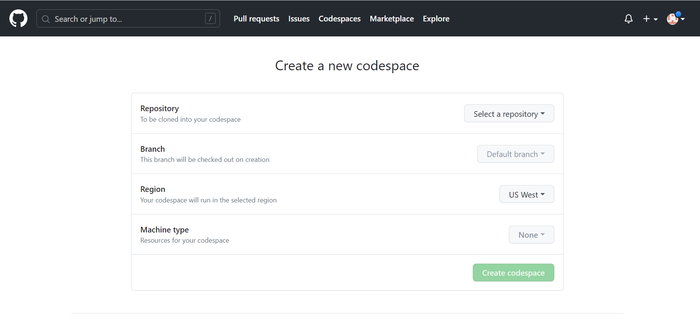
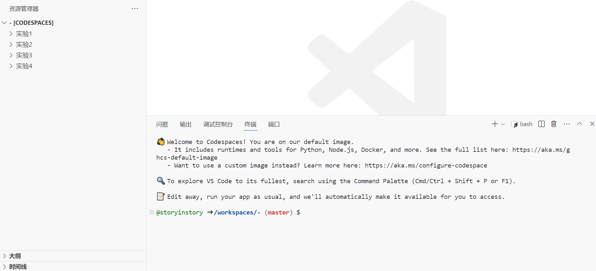
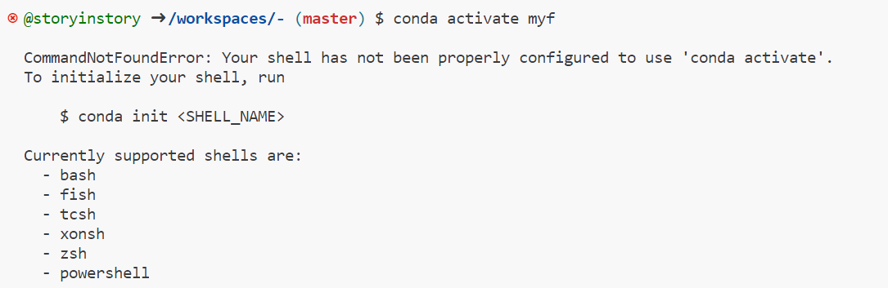
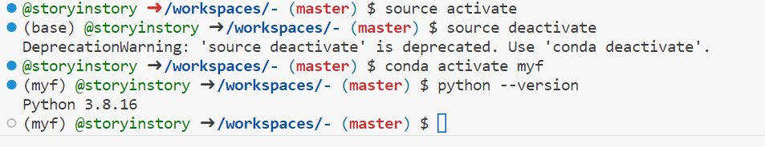

## 实验五 使用TensorFlow Lite Model Maker生成图像分类模型

### Github Codespace的TensorFlow环境安装

进入github codespace界面 

注册新仓库



进入之后发现界面与VScode大致相仿，经查阅得知可在VScode中通过Codespace插件进行工作。



### 创建虚拟环境

通过conda创建一个新的python环境 -  tf

```shell
conda create -n myf python=3.8
```

```shell
conda activate myf
```

此时报错如下：



依次执行下面这两条命令，然后就可以激活环境了。
source activate
source deactivate



```shell
pip install tflite-model-maker
```

```shell
pip install conda-repo-cli==1.0.4
```

报错如下：

```shell
ERROR: Could not find a version that satisfies the requirement conda-repo-cli==1.0.4 (from versions: none)
ERROR: No matching distribution found for conda-repo-cli==1.0.4
```


````shell
import os

import numpy as np

import tensorflow as tf
assert tf.__version__.startswith('2')

from tflite_model_maker import model_spec
from tflite_model_maker import image_classifier
from tflite_model_maker.config import ExportFormat
from tflite_model_maker.config import QuantizationConfig
from tflite_model_maker.image_classifier import DataLoader

import matplotlib.pyplot as plt
image_path = tf.keras.utils.get_file(
      'flower_photos.tgz',
      'https://storage.googleapis.com/download.tensorflow.org/example_images/flower_photos.tgz',
      extract=True)
image_path = os.path.join(os.path.dirname(image_path), 'flower_photos')
data = DataLoader.from_folder(image_path)
train_data, test_data = data.split(0.9)
model = image_classifier.create(train_data)
````

